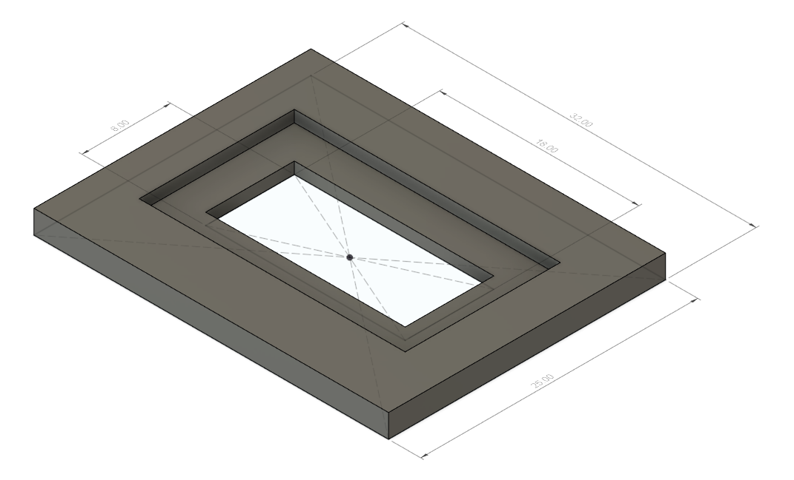

# Faucetwo Damper

The knob assembly for the Faucetwo controller use a set of rubber pads to dampen the rotation. This folder contains a CAD model and 2D drawing for replication. Both files are millimeter units.

The overall thickness is about 2.1mm and the smaller thickness in the center is about 1.05mm (it's hard to measure soft rubber, but it did not appear to be exact integers).

It appears to be made from a rubber with durometer 65 Shore OO, which is roughly equivalent to 20 Shore A.
